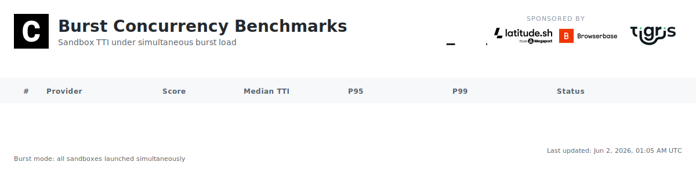

[](https://github.com/computesdk/benchmarks/actions/workflows/benchmarks.yml)
[](./LICENSE)

**TTI (Time to Interactive)** = API call to first command execution. Lower is better.

<br>

## What We Measure

**Daily: Time to Interactive (TTI)**

```
API Request → Provisioning → Boot → Ready → First Command
└───────────────────── TTI ─────────────────────┘
```

Each benchmark creates a fresh sandbox, runs `echo "benchmark"`, and records wall-clock time. 10 iterations per provider, every day, fully automated.

**Powered by ComputeSDK** — We use [ComputeSDK](https://github.com/computesdk/computesdk), a multi-provider SDK, to test all sandbox providers with the same code. One API, multiple providers, fair comparison. Interested in multi-provider failover, sandbox packing, and warm pooling? [Check out ComputeSDK](https://github.com/computesdk/computesdk).

**Sponsor-only tests coming soon:** Stress tests, warm starts, multi-region, and more. [See roadmap →](#roadmap)

[Full methodology →](./METHODOLOGY.md)

<br>

## Transparency

- 📖 **Open source** — All benchmark code is public
- 📊 **Raw data** — Every result committed to repo
- 🔁 **Reproducible** — Anyone can run the same tests
- ⚙️ **Automated** — Daily at 5pm Pacific (00:00 UTC) via GitHub Actions on Namespace runners
- 🛡️ **Independent** — Sponsors cannot influence results

<br>

## Sponsors

Sponsors enable independent benchmark infrastructure. **Sponsors cannot influence methodology or results.**

<a href="https://archil.com/"></a>

[Learn more →](./SPONSORSHIP.md)

<br>

## Roadmap

- [x] computesdk.com/benchmarks
- [x] Add P95 & P99
- [x] TTI n=100 test
- [x] TTI n=100 concurrency test (staggered + burst)
- [ ] 10,000 concurrent sandbox stress test
- [ ] Cold start vs warm start metrics
- [ ] Multi-region testing
- [ ] Cost-per-sandbox-minute

<br>

---

MIT License
