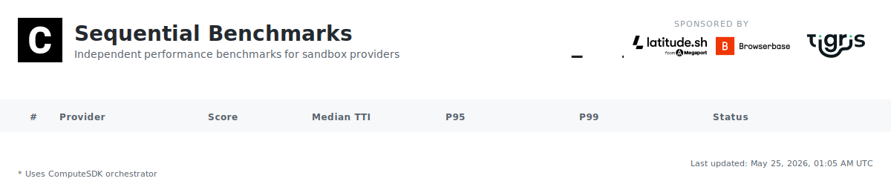
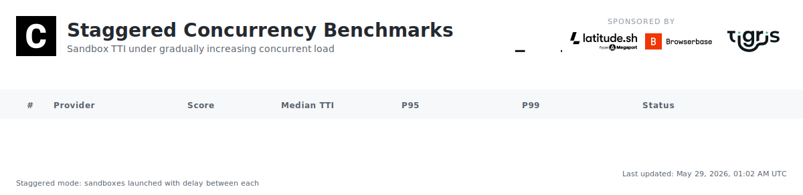

[](https://github.com/computesdk/benchmarks/actions/workflows/benchmarks.yml)
[](./LICENSE)

**TTI (Time to Interactive)** = API call to first command execution. Lower is better.

<br>

## What We Measure

**Daily: Time to Interactive (TTI)**

```
API Request → Provisioning → Boot → Ready → First Command
└───────────────────── TTI ─────────────────────┘
```

Each benchmark creates a fresh sandbox, runs `echo "benchmark"`, and records wall-clock time. 10 iterations per provider, every day, fully automated.

**Powered by ComputeSDK** — We use [ComputeSDK](https://github.com/computesdk/computesdk), a multi-provider SDK, to test all sandbox providers with the same code. One API, multiple providers, fair comparison. Interested in multi-provider failover, sandbox packing, and warm pooling? [Check out ComputeSDK](https://github.com/computesdk/computesdk).

**Sponsor-only tests coming soon:** Stress tests, warm starts, multi-region, and more. [See roadmap →](#roadmap)

<br>

## Methodology

Each benchmark creates a fresh sandbox, runs `echo "benchmark"`, and records wall-clock time. We run three test modes daily:

**Sequential** — Sandboxes are created one at a time. Each is created, tested, and destroyed before the next begins. 100 iterations per provider. This is the baseline — isolated cold-start performance with no contention.

**Staggered** — 100 sandboxes are launched per provider with a 200ms delay between each, gradually ramping up concurrent load. Reveals how TTI degrades under increasing pressure, queue depth effects, and rate limiting behavior.

**Burst** — 100 sandboxes are created simultaneously with no delay between launches. Tests how providers handle sudden spikes — provisioning queue depth, rate limiting, and failure rates under peak demand.

For each provider we report min, max, median, P95, P99, and average TTI, plus a **composite score** (0–100) that combines weighted timing metrics with success rate. Providers must be both fast *and* reliable to score well.

### Composite Score

Each timing metric is scored against a fixed 10-second ceiling: `score = 100 × (1 − value / 10,000ms)`. A 200ms median scores 98; anything ≥10s scores 0. These individual scores are combined with weighted emphasis on median (50%), P95 (20%), max (15%), P99 (10%), and min (5%), then multiplied by the provider's success rate (0–1). A provider with 90% success has its score reduced by 10% — reliability is non-negotiable.

All tests run on GitHub Actions at 00:00 UTC daily. Providers are tested using ComputeSDK — no gateway or proxy layer.

[Full methodology →](./METHODOLOGY.md)

<br>

## Transparency

- 📖 **Open source** — All benchmark code is public
- 📊 **Raw data** — Every result committed to repo
- 🔁 **Reproducible** — Anyone can run the same tests
- ⚙️ **Automated** — Daily at 5pm Pacific (00:00 UTC) via GitHub Actions on Namespace runners
- 🛡️ **Independent** — Sponsors cannot influence results

<br>

## Sponsors

Sponsors enable independent benchmark infrastructure. **Sponsors cannot influence methodology or results.**

<a href="https://archil.com/"></a>

[Learn more →](./SPONSORSHIP.md)

<br>

## Roadmap

- [x] computesdk.com/benchmarks
- [x] Add P95 & P99
- [x] TTI n=100 test
- [x] TTI n=100 concurrency test (staggered + burst)
- [ ] 10,000 concurrent sandbox stress test
- [ ] Cold start vs warm start metrics
- [ ] Multi-region testing
- [ ] Cost-per-sandbox-minute

<br>

---

MIT License
